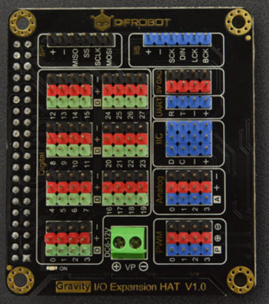

# DFRobot IO expansion HAT for Pi 

* [English Version](./README.md)

这款树莓派扩展板通过I2C和树莓派通信，它扩展了10个GPIO引脚，1个SPI接口，4个IIC接口、1个UART接口, 和4个12位ADC接口，且各扩展接口样式完全兼容DFRobot的Gravity接口。




## 产品链接（[https://www.dfrobot.com.cn/goods-2041.html](https://www.dfrobot.com.cn/goods-2041.html)）
    SKU: DFR0566

## 目录

  * [概述](#概述)
  * [库安装](#库安装)
  * [方法](#方法)
  * [兼容性](#兼容性)
  * [历史](#历史)
  * [创作者](#创作者)

## 概述

这是一个树莓派外设扩展板库，它具有以下特点:
1. 读取12位ADC值。
2. 设置PWM的频率和占空比。
3. 驱动数字RGB灯。
4. 驱动180度伺服电机

## 库安装

1. 下载库至树莓派，要使用这个库，首先要将库下载到Raspberry Pi，命令下载方法如下:<br>
```python
sudo git clone https://github.com/DFRobot/DFRobot_RaspberryPi_Expansion_Board
```
2. 打开并运行例程，要执行一个例程demo_x.py，请在命令行中输入python demo_x.py。例如，要执行demo_adc.py 例程，你需要输入:<br>

```python
python demo_adc.py 
```

## 方法

```python
  '''!
    @brief    树莓派扩展板初始化
    @return   扩展板状态
  '''
  def begin(self):
    
  '''!
    @brief    设置树莓派扩展板的IIC通信地址，改地址重启生效
    @param address:    IIC地址,范围1~127
  '''
  def set_addr(self, addr):
    
  '''!
    @brief    使能PWM功能，使用该功能需给扩展板外部供电。
  '''
  def set_pwm_enable(self):
    
  '''!
    @brief  失能PWM
  '''
  def set_pwm_disable(self):
    
  '''!
    @brief    设置pwm频率
    @param freq: PWM频率，范围 1 - 1000
  '''
  def set_pwm_frequency(self, freq):
    
  '''!
    @brief    设置PWM通道和占空比。
    @param chan: 列表类型     1个或多个通道集合，可以是1~4或ALL，即所有通道
    @param duty: 浮点类型    占空比，范围 0.0 ~ 100.0
  '''
  def set_pwm_duty(self, chan, duty):
    
  '''!
    @brief  使能ADC功能。
  '''
  def set_adc_enable(self):
    
  '''!
    @brief    失能ADC功能。
  '''
  def set_adc_disable(self):
    
  '''!
    @brief    获取ADC的值
    @param chan: int类型    单个通道或多个通道集合，范围1~4或ALL，即所有通道
    @return :list类型       通道ADC列表
  '''
  def get_adc_value(self, chan):
    
  '''!
    @brief    如果你忘记了树莓派扩展本的地址，你可以调用这个函数来检测该地址
    @return   地址列表
  '''
  def detecte(self):
    

class DFRobot_Epansion_Board_Digital_RGB_LED():
  '''!
    @param board: DFRobot_Expansion_Board   操作数字rgb灯的实例，测试灯的链接： https://www.dfrobot.com/product-1829.html
    @note 这款LED必须必须连接到PWM通道引脚上。 
  '''
  def __init__(self, board):
    
  '''!
    @brief    设置数字RGB LED颜色通道，这些参数不能重复
    @param chan_r: int    设置红色分量通道，范围1~4
    @param chan_g: int    设置绿色分量通道，范围1~4
    @param chan_b: int    设置蓝色分量通道，范围1~4
  '''
  def begin(self, chan_r, chan_g, chan_b):
    
  '''!
    @brief    设置LED的RGB888格式颜色
    @param r: int   颜色红色分量
    @param g: int   颜色绿色分量
    @param b: int   颜色蓝色分量
  '''
  def color888(self, r, g, b):
    
  '''!
    @brief   设置24位颜色显示
    @param color: int   24位颜色
  '''
  def color24(self, color):
    
  '''!
    @brief    设置18位颜色
    @param color: int   16位颜色
  '''
  def color565(self, color):
    

class DFRobot_Expansion_Board_Servo():
  '''!
    @param board: DFRobot_Expansion_Board   操作伺服电机实例,测试所用伺服电机的链接： https://www.dfrobot.com/product-255.html
    @note 伺服电机必须连接到pwm通道
  '''
  def __init__(self, board):
    
  '''!
    @brief    初始化
  '''
  def begin(self):
    
  '''!
    @brief    伺服电机移动 move
    @param id: list     单个通道或多个通道集合，范围1~4或ALL，即所有通道
    @param angle: int   转动角度，范围0~180度
  '''
  def move(self, id, angle):
    

class DFRobot_Expansion_Board_IIC(DFRobot_Expansion_Board):
  '''!
    @param bus_id: int   树莓派的IIC总线id
    @oaram addr: int     树莓派扩展板IIC地址
  '''
  def __init__(self, bus_id, addr):
```

## 兼容性

| 主板         | 通过 | 未通过 | 未测试 | 备注 |
| ------------ | :--: | :----: | :----: | :--: |
| RaspberryPi2 |      |        |   √    |      |
| RaspberryPi3 |      |        |   √    |      |
| RaspberryPi4 |  √   |        |        |      |

* Python 版本

| Python  | 通过 | 未通过 | 未测试 | 备注 |
| ------- | :--: | :----: | :----: | ---- |
| Python2 |  √   |        |        |      |
| Python3 |  √   |        |    √    |      |

## 历史

- 2019/03/28 - 1.0.0 版本

## 创作者

Written by Frank(jiehan.guo@dfrobot.com), 2021. (Welcome to our [website](https://www.dfrobot.com/))


